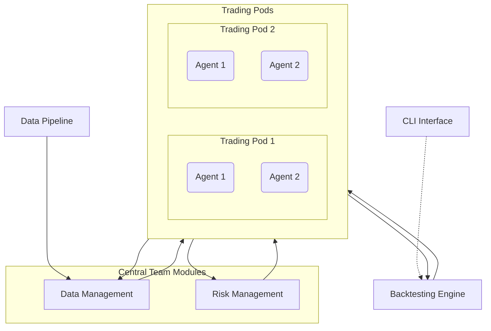

# Magents
Multi-Agent Generative Trading System
This is a proof of concept for a AI powered multi-strategy hedge fund

# Proposal: Open-Source Multi-Agent Backtesting & Simulation Framework

## Introduction  
This proposal outlines an open-source Python framework for a **multi-strategy hedge fund backtesting and simulation system**. The platform is designed as a multi-agent system in which independent strategy “pods” operate concurrently within a shared simulation environment. The goal is to enable realistic backtesting of multiple trading strategies under one umbrella, with unified data feeds and rigorous risk controls. Key design goals include modularity (each component of the system can be developed and extended independently), scalability to many strategies, and high fidelity simulation of market conditions (including transaction costs and slippage). By open-sourcing the framework, the project can benefit from community contributions and serve as a foundation for researchers and practitioners to test complex trading strategies.

## High-Level Architecture  
The system follows a hub-and-spoke architecture with central services (data and risk management) supporting multiple autonomous trading pods. A high-level architecture diagram is shown below, illustrating the core components and their interactions:

In this architecture, **Central Team modules** (data and risk management) act as shared utilities for all trading pods. The **Data Pipeline** feeds market and alternative data into a **Data Management** module, which preprocesses and distributes the data to the trading pods. Each **Trading Pod** contains one or more agents running a specific strategy; they receive data updates and issue trade orders independently. The **Backtesting Engine** orchestrates the simulation timeline and executes orders, returning fills and market feedback to the pods. A **Risk Management** module continuously monitors all pods’ positions and exposures, enforcing constraints and aggregating portfolio risk. Finally, a command-line **CLI Interface** allows users to configure simulations, launch backtests, and review performance results. Below we describe each component in detail.

## Key Components  

### Central Team Modules  
**Data Management:** This module is responsible for aggregating and preprocessing all relevant datasets (price feeds, fundamental data, news sentiment, etc.). It collects data from the Data Pipeline, cleans and normalizes it, and stores it in a form accessible to the trading pods. Data Management ensures that agents have a unified view of market data (e.g. handling corporate actions or missing data) and can query historical data as needed. It may also perform feature engineering or calculate common indicators that can be shared across strategies. By centralizing data handling, the system avoids duplication of data-loading logic in each pod.  

**Risk Management:** The central risk management module monitors portfolio risk in real time across and within all pods. It acts as a “risk officer” in the simulation, checking every proposed trade against risk constraints before allowing execution. For example, before an order is executed, the risk module can verify it doesn’t violate position limits or leverage limits and can adjust or reject orders not in line with risk objectives ([
      
        System Architecture Of Automated Trading Systems - 
      
      koppian adventures
    ](https://hkopp.github.io/2016/04/system-architecture-of-automated-trading-systems#:~:text=Before%20executing%20the%20buy%20or,processed%20by%20the%20execution%20handler)). The Risk Management module also computes risk metrics (VaR, exposure by asset class, etc.) and shares these metrics with the pods so that strategies are aware of their risk utilization. In a multi-strategy fund context, risk is typically managed at multiple levels – both at the individual strategy (pod) level and at the overall portfolio level ([Aurum Insight - May 24 - Multi-strategy hedge fund primer](https://www.aurum.com/wp-content/uploads/Aurum-Insight-May-24-Multi-strategy-hedge-fund-primer-2.pdf#:~:text=Risk%20management%20Multi,the%20PM%20level%20PMs%20and)). Each pod (analogous to a PM’s book in a hedge fund) operates within pre-set risk parameters (e.g. which assets it can trade, max gross or net exposure, concentration limits, drawdown limits) that are agreed upon with the central risk team ([Aurum Insight - May 24 - Multi-strategy hedge fund primer](https://www.aurum.com/wp-content/uploads/Aurum-Insight-May-24-Multi-strategy-hedge-fund-primer-2.pdf#:~:text=the%20risk%20team%20typically%20agree,their%20contracts%20would%20be%20terminated)). The Risk Management module enforces these rules during backtests by triggering stop-loss orders, halting a pod’s trading after large losses, or capping additional exposure if limits would be breached. It generates risk reports and alerts — for example, warning if the fund’s aggregate positions have high correlation or if multiple pods are unintentionally piling into the same trade. Overall, this central module ensures that even in simulation, no strategy can jeopardize the fund’s risk profile, reflecting the sophisticated risk frameworks seen in real multi-strategy funds (which apply risk controls at both the individual PM level and firm-wide level ([Aurum Insight - May 24 - Multi-strategy hedge fund primer](https://www.aurum.com/wp-content/uploads/Aurum-Insight-May-24-Multi-strategy-hedge-fund-primer-2.pdf#:~:text=portfolios%20across%20many%20asset%20classes,exposure%2C%20concentration%20limits%2C%20factor%20exposures))).

### Trading Pods  
Trading pods represent independent strategy teams, each with its own approach (e.g. one pod might do equity long/short with fundamental analysis, another does statistical arbitrage on futures, etc.). A pod consists of one or more **agents** that share information internally and collectively implement the pod’s strategy. Agents within a pod might be divided by role – for example, one agent scans news and produces sentiment signals, while another agent executes trades based on those signals – and they can communicate with each other through an internal messaging or shared memory system. However, **agents in different pods cannot communicate** or share state. This isolation mirrors the real-world scenario where strategy teams operate independently (preventing information leakage and undue influence between strategies). Each pod is allocated its own capital and maintains its own positions; agents in the pod can see the pod’s positions and P&L, and they collaborate to achieve the strategy’s goals. 

From the system’s perspective, each trading pod subscribes to the data feeds relevant to its universe (provided by Data Management) and makes autonomous decisions. Upon receiving new market data, the pod’s agents may process it (potentially in parallel or in sequence) and decide whether to generate trade orders. The pod then sends orders to the backtesting engine for execution. The pods run concurrently – for example, one pod might be a high-frequency strategy reacting to tick data, while another is a slower strategy using daily bars; the framework allows both to operate in parallel on their respective timelines. The modular design makes it easy to **add new pods** by implementing the agent logic for a new strategy and registering it – the rest of the system (data, execution, risk) will automatically integrate the new pod. This design encourages extensibility: the fund can grow to include many strategies without a rewrite of core components, simply by plugging in additional pods.  

### Backtesting Engine  
The backtesting engine is the core simulation engine that **advances the market clock and processes events**. It is an event-driven engine that handles: time progression, market data events, order execution, and portfolio accounting. In a backtest run, the engine steps through historical data (or a simulated live feed), delivering market events (price ticks or bar updates) to all subscribed trading pods. It collects the trade orders emitted by agents in response to those events and simulates their execution. 

**Order execution simulation** is a crucial function of the engine. The engine supports different order types (market, limit, stop orders, etc.) and simulates an order book to a configurable extent. For example, market orders can be filled at the next available price with a slippage model, while limit orders will only fill if the market price reaches the limit (and can be partially filled depending on volume). For higher realism, the engine can model **slippage and market impact** – e.g. using the bid-ask spread and volume to adjust fill price. It’s important to model these effects accurately: if market impact and order book dynamics are ignored, backtests may unrealistically outperform live trading ([Successful Backtesting of Algorithmic Trading Strategies - Part II | QuantStart](https://www.quantstart.com/articles/Successful-Backtesting-of-Algorithmic-Trading-Strategies-Part-II/#:~:text=When%20backtesting%2C%20it%20is%20essential,book%20are%20not%20modelled%20accurately)). The engine can either use simple models (like a fixed slippage per trade or percentage of volume) or more complex ones (simulating a full limit order book and matching engine). Transaction costs are also incorporated: the engine charges commissions, fees, and spreads on each trade, which are debited from the appropriate pod’s P&L. Support for **different time resolutions** means the engine can run on tick data (processing every trade or quote), on minute-by-minute bars, or on daily bars, depending on the use case. The internal clock is event-driven – if multiple pods operate on different frequencies, the engine will handle the highest frequency events and still allow lower-frequency strategies to update on their schedule. For instance, a daily strategy’s agent might only get a data event once per day, while a intraday strategy agent gets events every tick. The engine keeps track of all positions and cash for each pod (and optionally an aggregated portfolio). It ensures that after each simulated trade, the positions and P&L are updated, and it will report these updates back to the pods or to the central Portfolio Management for risk calculations.  

Finally, the backtesting engine logs all transactions and market data events (for later analysis or debugging). Despite being a simulation, it is designed to mimic a real trading environment as closely as possible, so that strategies tested in this framework perform similarly in live trading. This includes honoring trading session times (e.g., no trading on weekends for stocks unless specified), respecting order latency (orders can be executed with a slight delay to mimic network latency if needed), and optionally randomizing factors like slippage to test strategy robustness.  

### Data Pipeline  
The data pipeline provides the **lifeblood of information** to the entire system. It is a configurable subsystem that feeds both **structured data** (market prices, volumes, technical indicators) and **unstructured data** (news articles, social media sentiment, economic releases) into the backtesting engine and Data Management module. In backtesting mode, the data pipeline typically reads from historical data sources – for example, price history from CSV files or a database, and a time-stamped news sentiment file – and replays this data in chronological order. The pipeline can emulate real-time streaming: instead of providing all data at once, it yields data incrementally as if time is passing, which allows the engine and agents to process events sequentially. 

To handle multiple data types, the pipeline might consist of multiple feeders or channels. For instance, one feeder stream could be market data (quotes/trades), another could be news headlines, and another macro-economic indicators. The Data Management module subscribes to these feeds, merges them by timestamp, and distributes updates to agents. Internally, this could be implemented with a publish/subscribe mechanism – data sources publish events, and interested agents (or pods) subscribe to the relevant topics. This design is similar to other multi-agent trading platforms where specialized **feeder agents** ingest market data and a **router/broadcaster agent** disseminates it to strategy agents ([data/europython-2016/videos/miguel-sanchez-de-leon-peque-developing-a-real-time-automated-trading-platform-with-python.json at main · pyvideo/data · GitHub](https://github.com/pyvideo/data/blob/master/europython-2016/videos/miguel-sanchez-de-leon-peque-developing-a-real-time-automated-trading-platform-with-python.json#:~:text=%2AosMarkets%2A.%5CnThis%20platform%20implements%20specialized%20agents%3A%5Cn%5Cn,agent%20which%20is%20designed%20to)). By decoupling data ingestion from data consumption, the system makes it easy to add new data sources: e.g., one can plug in a new sentiment data feed with minimal changes to the rest of the code. The pipeline also supports **historical data queries** – for example, if an agent needs the last N days of data to compute an indicator at startup, it can request that from Data Management (which in turn pulls from the pipeline’s historical store). 

During a simulation run, the data pipeline ensures that all pods receive a **synchronized view of the market**. If, for example, one strategy trades U.S. equities and another trades Forex, the pipeline will handle both data streams and ensure each pod only gets relevant data (or the entire combined stream if desired). The pipeline can simulate **real-time delays** or latencies as well, if needed, to test the impact of data timing on strategy performance.  

In summary, the Data Pipeline and Management infrastructure provides a flexible way to feed in any kind of data. This could include level-1 market data (prices/volume), level-2 order book data, derived features (alpha factors, technical signals computed on the fly), or external signals (analyst ratings, alternative data). Because it is modular, users of the framework can easily extend it to new data types. For example, if someone wants to backtest a strategy based on weather data or Google search trends, they can add a new data feeder for that source and have it flow into the existing system without modifying the core engine or pods.

### Risk & Portfolio Management  
Risk and portfolio management functions form the safety layer around the trading activity. This component enforces **global risk constraints** and manages the overall portfolio aggregation. In practice, this could be an extension of the Risk Management module discussed earlier, with additional responsibilities for portfolio-level actions. Key features include:  

- **Position Limits:** The system can impose limits on position sizes (per instrument or per pod) and overall exposure. For example, a pod might not be allowed to hold more than 5% of daily trading volume of any stock, or not more than $10M in any single position. If an agent attempts to exceed these limits, the risk manager will reject or scale down the order.  

- **Exposure Limits:** The framework can track exposures by asset class, sector, or factor. For instance, it can ensure that the combined portfolio (summing across all pods) isn’t net long or short beyond a threshold in any sector, or that two pods together don’t inadvertently double up exposure to a certain risk factor. If the combined exposure does breach a threshold, the system can issue warnings or trigger hedging actions (for example, alerting a central fund manager agent to reduce exposure). This reflects real multi-strategy fund operations where risk is managed both at individual book level and at the firm-wide level ([Aurum Insight - May 24 - Multi-strategy hedge fund primer](https://www.aurum.com/wp-content/uploads/Aurum-Insight-May-24-Multi-strategy-hedge-fund-primer-2.pdf#:~:text=fund%20industry,their%20gross%20and%20net%20exposure)) ([Aurum Insight - May 24 - Multi-strategy hedge fund primer](https://www.aurum.com/wp-content/uploads/Aurum-Insight-May-24-Multi-strategy-hedge-fund-primer-2.pdf#:~:text=Risk%20is%20also%20managed%20on,strategy%20funds%20with)).  

- **Stop-Loss Mechanisms:** The risk module can implement stop-loss and take-profit rules at multiple levels. Each pod can have a maximum drawdown limit – e.g., if a strategy loses more than X%, it must reduce positions or stop trading. The system will monitor each pod’s P&L in real time; if the limit is hit, it can automatically close the pod’s positions (simulate a stop-loss) and freeze further trading for that pod. Similarly, individual positions can have stop-loss levels (set by the strategy or by risk policy) that trigger order generation to exit the position if reached. These mechanisms protect against runaway losses in the backtest and allow evaluation of risk management techniques.  

- **Portfolio Aggregation:** The framework will maintain an aggregated view of the entire simulated fund’s portfolio. This means summing up positions and P&L of all pods to compute firm-level metrics. The Portfolio Management function can produce reports such as overall leverage, total gross and net exposure, sector-wise exposure, top risk contributors, VAR (Value at Risk) of the whole portfolio, etc. It can also simulate **hedging at the portfolio level** – for example, if the combined portfolio is too long beta, a central hedging strategy (possibly another special “pod”) could short an index future to reduce beta exposure. The system allows such overlays to be tested by treating them as additional agents that listen to portfolio-level data.  

- **Risk Reports & Analytics:** At the end of a backtest (and potentially during runtime), the framework will output comprehensive risk analytics. This includes time series of each pod’s P&L and drawdowns, instances where limits were hit, distribution of returns, correlations between pods, and so on. These reports help the user analyze how each strategy performed not just on a standalone basis but in the context of a multi-strategy portfolio. The framework could integrate with libraries for calculating performance metrics and risk metrics (Sharpe ratio, max drawdown, VAR, etc.) and present these in a summary. Because all trading decisions and market data are recorded, the system enables detailed **post-mortem analysis** of risk – for example, one could determine how much each strategy contributed to a particular loss event or how the diversification affected overall volatility.  

By handling risk and portfolio management centrally, the framework ensures that *no matter how many strategies are added*, the combined outcome stays within defined risk parameters. This mirrors the practice in real multi-strategy hedge funds where a central risk team oversees all strategy pods and can intervene or mandate changes to keep the entire fund’s risk in check ([Aurum Insight - May 24 - Multi-strategy hedge fund primer](https://www.aurum.com/wp-content/uploads/Aurum-Insight-May-24-Multi-strategy-hedge-fund-primer-2.pdf#:~:text=Generally%2C%20risk%20management%20is%20applied,their%20contracts%20would%20be%20terminated)) ([Aurum Insight - May 24 - Multi-strategy hedge fund primer](https://www.aurum.com/wp-content/uploads/Aurum-Insight-May-24-Multi-strategy-hedge-fund-primer-2.pdf#:~:text=others%20the%20risk%20team%20may,strategy%20funds%20with)). It also enables users to experiment with different risk rules and see how they would impact a collection of strategies (for instance, comparing performance with and without strict stop-loss rules). The risk & portfolio management component is thus critical for evaluating multi-strategy portfolios under realistic constraints.

### CLI Interface  
The framework includes a command-line interface that makes it easy for users to configure, run, and analyze backtests without needing to dive into code. The **CLI Interface** allows specification of which strategies (pods) to include in a run, the period of historical data to use, and various runtime parameters. For example, a user could launch a backtest by running a command specifying “start date = 2015-01-01, end date = 2020-12-31, include strategies = {Equity_LS, StatArb}, initial capital = $50MM split across strategies” etc. This will trigger the system to load the needed data for that timeframe, set initial portfolio values, and initialize the chosen pods. 

Through the CLI, users can also **tune parameters** of strategies or the simulation. This includes things like strategy hyperparameters (e.g. a lookback window length or risk appetite setting for a pod) and global settings (like transaction cost assumptions or slippage model selection). The interface could accept a config file (YAML/JSON) or command-line flags to override default settings. This makes it simple to run batch tests or optimization sweeps (e.g., running the same strategy over multiple parameter combinations or multiple time periods).  

Once a backtest is running, the CLI can display real-time progress and key performance metrics. It might show a live updating P&L or risk metric for each pod, or simply log significant events (like “Pod A hit stop-loss, stopping trading on 2018-02-05”). After completion, the CLI will output results and can generate basic **performance visualization**. For instance, it can produce an equity curve (cumulative P&L chart) for each strategy and for the combined portfolio, bar charts of monthly returns, or tables of summary statistics. These could be saved as image files or shown in an interactive window depending on the environment. If graphical display is not available directly through the CLI, the tool might export the data to a file that can be loaded in a Jupyter notebook or desktop GUI for further analysis. The key idea is to streamline the user experience: running a multi-strategy backtest and seeing the outcome should be as simple as a single command. 

The CLI also handles **scenario configuration**. Users can select preset scenarios (for example, a 2008 financial crisis scenario, or a specific market regime) if the framework provides such presets. It could also allow toggling certain simulation features on/off (for example, “run with transaction costs off” for an ideal scenario, or “enable detailed order book simulation” for a more realistic scenario). This flexibility aids in understanding strategy sensitivity to various factors. 

In summary, the CLI Interface serves as the front-end to the backtesting framework. It abstracts away the internal complexity and presents the user with an accessible way to conduct experiments. This is particularly important in an open-source project, as it lowers the barrier to entry for new users (who can get started without writing new code, by reusing existing strategy pods and configurations). Over time, the CLI can be expanded into a richer user interface or even a web dashboard, but initially it will focus on core tasks: configuration of runs, launching backtests, and presenting results in a clear manner.

## System Design Considerations  

### Agent Communication  
Within each trading pod, agents need to share information (such as signals or state) and coordinate decisions. To facilitate this, the framework will include an internal messaging system for agent communication. A lightweight publish/subscribe or message queue pattern will be used: for example, when Data Management sends a new market tick to a pod, it could be published on an internal bus that all agents in that pod subscribe to. Agents can also publish their own messages (e.g., an agent that generates a signal might broadcast “Buy signal for AAPL” which another agent picks up to execute). This communication is confined *within* the pod – there is **no inter-pod messaging** to ensure strategies remain independent. Technically, this can be achieved by giving each pod its own message namespace or using separate channels/threads for each pod. We can leverage existing messaging libraries (for instance, ZeroMQ or similar) to implement these channels efficiently ([data/europython-2016/videos/miguel-sanchez-de-leon-peque-developing-a-real-time-automated-trading-platform-with-python.json at main · pyvideo/data · GitHub](https://github.com/pyvideo/data/blob/master/europython-2016/videos/miguel-sanchez-de-leon-peque-developing-a-real-time-automated-trading-platform-with-python.json#:~:text=real,the%20historical%20data%20and%20distributes)). In fact, prior implementations of multi-agent trading systems have successfully used ZeroMQ to allow agents to talk in flexible patterns (push-pull, pub-sub, etc.) ([data/europython-2016/videos/miguel-sanchez-de-leon-peque-developing-a-real-time-automated-trading-platform-with-python.json at main · pyvideo/data · GitHub](https://github.com/pyvideo/data/blob/master/europython-2016/videos/miguel-sanchez-de-leon-peque-developing-a-real-time-automated-trading-platform-with-python.json#:~:text=Python%3A%20,%2A%2ABrain%2A%2A%20is%20the%20most)). The design will ensure that message passing has low overhead to not bottleneck simulation speed. 

One agent in a pod might act as a **coordinator** or simply all agents act autonomously. The architecture does not force a hierarchy among agents, but allows it (for example, a pod could designate a “lead” agent that makes final trade decisions using inputs from other agents). Communication latencies can be configured to mimic real delays if needed (though in backtesting, agents often run in the same process for simplicity). By using a modular message-passing approach, we make the system flexible: one could easily move agents to separate processes or machines for scalability, and as long as they connect to the pod’s message bus, the logic remains the same. This could enable a distributed simulation where intensive strategies run on different servers. 

### Modular Implementation  
Each component of the framework is developed as an independent module with clear interfaces. This modular design means, for example, the Data Pipeline/Management can be swapped out or extended without affecting the Trading Pods, as long as it adheres to the interface (publishing market data events in a certain format). Similarly, each trading pod conforms to a Strategy API (methods for initialization, receiving data, generating orders) so that new strategies can be added easily. The Backtesting Engine interacts with strategies through a generic order interface – meaning strategies can be black boxes that the engine doesn’t need to know details about, other than receiving orders and sending fills. Risk Management also operates through defined hooks (e.g., a function call or event when an order is placed, to approve or reject it, and periodic checks on positions). 

This modularity greatly improves **extensibility**. For instance, if a developer wants to add a new module for **transaction cost modeling** (say a more complex market impact model), they could extend the execution handler portion of the Backtesting Engine without touching the rest of the system. Or if someone wants to integrate a database of historical data, they could extend the Data Management to fetch data from that DB in addition to (or instead of) the provided CSV files. To maintain modularity, we will define data schemas and communication protocols between modules (potentially using Python dataclasses or pydantic models for clarity). 

Open-source development also benefits from modularity because different contributors can work on different parts in parallel. One team might focus on improving the Risk module (adding a new VaR calculation), while another builds new strategy pods, without stepping on each other’s toes. Testing is also easier since each module can be unit-tested in isolation (e.g., test the backtester’s order matching logic independently by feeding it fake orders, test a strategy pod by mocking data inputs). 

In software design terms, the system follows a **separation of concerns**: data handling, strategy logic, execution simulation, and risk checks are all separated. They interact through events or APIs. This means the framework could even allow partial re-use for other purposes (someone could reuse the Backtesting Engine and plug in their own strategies, or use the Data Pipeline and risk modules for a totally different simulation). The code structure will likely be organized into packages like `data`, `engine`, `strategies`, `risk`, `cli`, etc., each containing the relevant classes. Clear documentation and examples will accompany each module so that users can extend or customize the framework to their needs.

### Scalability  
Scalability is a key consideration since the framework should handle **multiple pods running in parallel**, potentially with high-frequency data or computationally heavy strategies. There are a few dimensions to scalability: computational concurrency, data throughput, and memory usage. 

**Concurrency:** The design will leverage Python’s capabilities (and possibly complementary libraries) to run pods concurrently. In a simple setup, we might use Python threads for each pod, allowing them to process data independently. The Backtesting Engine could act as a coordinator that sequentially steps through time, but at each time step, distributes data to pods and then gathers orders – the processing within each step can occur in parallel threads. For CPU-bound strategy code (like heavy numerical computations or ML model inference), using Python’s multiprocessing or an actor system (such as `multiprocessing.Pool` or an external library like Ray) would be beneficial to bypass the GIL. Another approach is to use an asynchronous event loop (asyncio) where each pod is a coroutine; however, given potential CPU-intensive tasks, multi-process might be more appropriate. The architecture does not hard-code one method, but we will aim to implement a **pluggable execution mode** (single-threaded for simplicity vs multi-threaded for performance). In a single-machine scenario, parallel threads/processes should allow leveraging multi-core CPUs to run, say, 10 strategies at once without slowdown (subject to I/O). For even larger scale, the messaging system could allow pods to be deployed on separate machines – for example, using a distributed computing framework, although that may be a future extension.  

**Data Throughput:** If backtesting on tick data or running many years of minute data, the pipeline must efficiently stream data without becoming a bottleneck. We will use efficient data structures (potentially numpy arrays or pandas DataFrames) for batch operations and consider memory-mapping large datasets to avoid loading everything into RAM at once. The system can be designed to **stream data** iteratively rather than load all history into memory (useful when simulating decades of tick data). Also, if multiple pods request similar data, the Data Management should not duplicate effort – it can fetch once and distribute to all. This ensures scaling to many pods doesn’t multiply the data load linearly.  

**Memory & Resource Management:** Each pod will maintain its own state, which includes potentially large objects (like ML models or data buffers). We need to monitor overall memory usage. The framework might allow configuration of how much history to keep in memory for agents (for example, an agent might only need the last N days of data). Users should be able to run a dozen strategies without running out of memory, assuming moderate data sizes. Additionally, the framework could offer options to skip certain detailed simulations to save time – e.g., if slippage modeling is too slow for a given use, it can be turned off. 

Scalability also refers to the ability to extend the system to new features. The modular design discussed helps here – adding more strategies or data types shouldn’t degrade performance significantly if the system is designed to handle them in parallel. We will test the framework with scenarios like “20 pods trading simultaneously on 1-second bar data” and profile the performance. If needed, critical sections can be optimized (using NumPy for vectorized math, or even writing Cython extensions for the execution engine’s inner loop if Python becomes too slow). We aim to keep the **backtesting speed** reasonable: e.g., simulating one year of minute data across multiple strategies in minutes rather than hours, so that users can iterate on strategy ideas quickly. 

Finally, the open-source nature means users might try to run the framework on various hardware – from a laptop to a cloud server. We will ensure it runs on different operating systems and can take advantage of more powerful machines (more CPU cores, more memory) when available. In the long run, we envision the framework being able to scale out to distributed setups (for example, each pod as a microservice). For now, the primary goal is to comfortably support **multiple concurrent strategies on a single machine** and handle substantial data volumes in backtesting.

## Implementation Roadmap  

To build this system, development will proceed in stages, each adding a set of features. Below is a high-level implementation roadmap:

1. **Foundation & Core Architecture:** Begin by establishing the core project structure and classes. Implement the skeleton of the Backtesting Engine (with a basic event loop), the Data Pipeline/Management (able to load simple price data), and stub out the Trading Pod and Risk Management interfaces. At this stage, focus on a single-threaded simple flow working end-to-end: e.g., feed data to one dummy strategy and print trades. Verify that the engine can step through time and that modules communicate via defined interfaces.

2. **Basic Single-Pod Backtest:** Implement a basic trading pod with a simple strategy (for example, a moving-average crossover strategy) to test the framework in action. Develop the order execution logic in the Backtesting Engine to handle market orders and basic limit orders on daily bar data. Introduce a rudimentary Portfolio tracker to update positions and P&L for the pod. Add basic Risk Management checks (like not allowing negative cash or oversized positions). This phase aims to achieve a functional backtest of one strategy from start to finish, producing a P&L output.

3. **Multi-Pod Support:** Extend the engine and data pipeline to support running **multiple pods in parallel**. Implement the internal messaging or subscription system so that the Data Management can broadcast market data to all pods and collect orders from them. Test with two simple strategies running simultaneously on non-interfering data (or even on the same instrument to see how the system handles independent decisions). Ensure that pods remain isolated (no shared global variables, etc.) except through the intended channels. At this point, evaluate performance and consider introducing multi-threading – for example, assign each pod to a thread or asynchronous task and manage synchronization at the engine level. This phase establishes the multi-agent nature of the framework.

4. **Central Risk Management & Enforcement:** Build out the Risk Management module with actual rules and enforcement. Define a configuration format for risk limits (per-pod and global) and implement checks such as: max position size, max leverage, per-pod drawdown limit, etc. Modify the order execution flow so that each order goes through a risk check before execution – this can be done by hooking into the Engine (e.g., the engine asks Risk module to validate each order). If an order violates a limit, decide how to handle it (reject it, trim it, or log a warning depending on the rule). Also implement **stop-loss triggers**: e.g., if a pod’s cumulative loss exceeds X, the Risk module can instruct the engine to close its positions (simulate market orders to exit) and disable further trading from that pod. Begin generating risk metrics during simulation (like current exposure, P&L drawdown) to include in logs or outputs. At the end of this phase, the system should be much safer – any strategy acting outside its bounds will be caught by the risk layer.

5. **Enhanced Backtesting Realism:** Improve the Backtesting Engine’s fidelity by adding **slippage, transaction costs, and order book simulation**. For slippage, implement one or two models (e.g., a simple model where market orders get filled at next bar’s open plus a penalty proportional to volume, and maybe a more advanced model using known bid-ask spreads). Include per-trade commission costs (configurable per asset class or percentage of trade). If data is available, incorporate bid/ask spreads from historical data, or allow the engine to simulate an order book with depth. For example, we could simulate that large orders move the price by a certain amount. As a result, backtest results will become more realistic by accounting for these frictions ([Successful Backtesting of Algorithmic Trading Strategies - Part II | QuantStart](https://www.quantstart.com/articles/Successful-Backtesting-of-Algorithmic-Trading-Strategies-Part-II/#:~:text=When%20backtesting%2C%20it%20is%20essential,book%20are%20not%20modelled%20accurately)). Additionally, expand support for **multiple time resolutions** explicitly: test the engine on tick data vs. minute bars vs. daily data to ensure the event handling and P&L accounting remain correct at each frequency. By this stage, the engine should handle all main mechanics of trading simulation robustly.

6. **Data Pipeline Expansion:** Augment the Data Pipeline to handle **multi-source data** and more complex scenarios. Introduce at least one unstructured data example (e.g., sentiment data). This involves timestamping those events and feeding them into the engine alongside price data. Ensure Data Management can merge different streams properly (for instance, multiple events occurring at the same timestamp should all be processed). Implement a mechanism for agents to subscribe only to relevant data (for example, a Forex strategy doesn’t need equity data). If not already done, implement on-demand historical data fetching for agents – e.g., an agent can request the last N data points for a symbol for initialization or indicator calculation. This phase might also involve connecting to an external data source or API for demonstration (like pulling price data from a free API in real-time for a live simulation mode). By the end of this step, the framework can ingest and utilize a rich set of data, making it suitable for strategies beyond just price-based ones.

7. **CLI Interface & Configuration:** Develop the user-facing CLI tool. This involves creating command-line commands or a small wrapper script that users can run with arguments. Implement parsing of configuration files for backtest settings (strategies to include, data range, initial capital, risk limits, etc.). Ensure that all major parameters of the system can be configured without code changes. Also, implement the result output in this step: when a backtest finishes, have the CLI produce a summary (e.g., print final returns of each pod and combined Sharpe ratio). If possible, integrate a simple visualization – for instance, use an ASCII chart or generate an image of the equity curve that the user can view. This is also the time to refine logging: provide useful console output during the run (like progress updates or alerts from risk management). Test the CLI by running a few different scenarios end-to-end and verifying that it’s user-friendly and robust against bad input.

8. **Testing & Optimization:** With all components in place, conduct extensive testing. Create unit tests for individual modules (e.g., test that the slippage model works as expected, test that risk limits correctly block trades). Also perform full system tests using known strategies: for example, if a trivial strategy that buys and holds should produce a known outcome on historical data, verify the backtester matches that outcome. Test edge cases like: no trades at all, extremely frequent trading, or a strategy that intentionally tries to break risk rules. Profile the performance with a larger number of pods or longer data and optimize any slow spots (this might involve using more efficient data structures or simplifying certain calculations). At this stage, also clean up the API and ensure the code is well-documented so that external developers can understand it. 

9. **Documentation & Release:** Prepare thorough documentation for the open-source release. This includes a **README** with an overview, instructions to install and run the framework, and examples of how to define a new strategy pod. Provide sample configuration files and maybe a tutorial (like a step-by-step guide to create a simple strategy and backtest it). If possible, include a few ready-made strategy implementations in the repository (they can be basic, just to show how pods are written and to let users run a demo out of the box). Finally, publish the code on a platform like GitHub under an open-source license. Encourage feedback from early users and outline contribution guidelines to foster a community around the project.

By following this roadmap, we will incrementally build a robust multi-agent backtesting system. Each phase ensures that a working product is in hand (even if limited), and subsequent phases add complexity and features. This approach allows for continuous testing and feedback, crucial for catching issues early in such a complex system. The end result will be a flexible and powerful framework that can help hedge fund teams and independent quants alike to simulate multi-strategy portfolios and refine their trading algorithms in a safe, controlled environment. 

