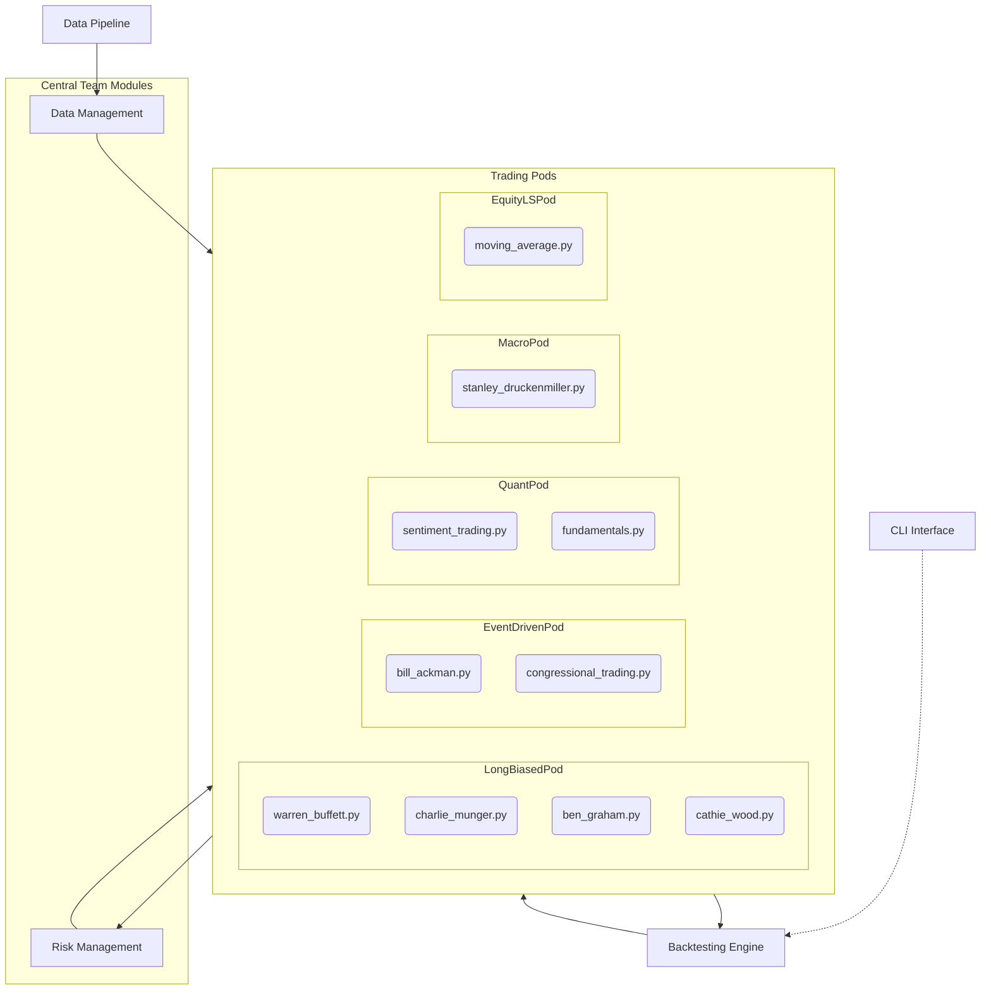

# Magents

**Multi-Agent Generative Trading System**

[](https://github.com/LLMQuant/magents/actions/workflows/ci.yml)
[](https://www.python.org/downloads/)
[](LICENSE)

An open-source Python framework for multi-strategy hedge fund simulation and backtesting. Magents models independent strategy "pods" as concurrent agents within a shared event-driven simulation, enabling realistic backtesting under unified data feeds and risk controls.

---

## Architecture


```mermaid
flowchart TD
    DP[Data Pipeline] --> DM[Data Management]

    subgraph CentralTeam [Central Team Modules]
        DM
        RM[Risk Management]
    end

    subgraph Pods [Trading Pods]
        subgraph LongBiasedPod
            L1(warren_buffett.py)
            L2(charlie_munger.py)
            L3(ben_graham.py)
            L4(cathie_wood.py)
        end

        subgraph EventDrivenPod
            E1(bill_ackman.py)
            E2(congressional_trading.py)
        end

        subgraph QuantPod
            Q1(sentiment_trading.py)
            Q2(fundamentals.py)
        end

        subgraph MacroPod
            M1(stanley_druckenmiller.py)
        end

        subgraph EquityLSPod
            ELS1(moving_average.py)
        end
    end

    DM --> Pods
    Pods --> RM
    RM --> Pods
    Pods --> BE[Backtesting Engine]
    BE --> Pods
    CLI[CLI Interface] -.-> BE
```

## Key Features

- **Multi-Agent Pods** — Each strategy runs as an independent pod with specialized agents (signal, execution, risk)
- **Event-Driven Engine** — Realistic order lifecycle with market data events, fills, and risk alerts
- **Central Risk Management** — Portfolio-level and global constraints (drawdown, position, leverage, exposure limits)
- **High-Fidelity Backtesting** — Configurable transaction costs, slippage, and support for market/limit/stop/stop-limit orders
- **Modular & Extensible** — Add new strategies, data feeds, or risk rules without modifying core code

---

## Quick Start

### Prerequisites

- Python 3.10+
- [Poetry](https://python-poetry.org/)

### Installation

```bash
git clone https://github.com/LLMQuant/magents.git
cd magents
poetry install
```

### Run a Backtest

```bash
# Basic backtest with default settings
poetry run magents --data-dir data/ --instruments AAPL,MSFT,GOOGL

# Custom time range, capital, and strategies
poetry run magents --data-dir data/ --instruments AAPL,MSFT,GOOGL \
    --start-date 2022-01-01 --end-date 2022-12-31 \
    --initial-capital 1000000 \
    --strategies ma,value,sentiment

# Use a config file and generate an HTML report
poetry run magents --data-dir data/ --instruments AAPL,MSFT \
    --config config/default.yaml --generate-report
```

### Example Script

```bash
poetry run python examples/run_multi_strategy_backtest.py
```

---

## Configuration

All parameters are configurable via YAML or JSON files. See [`config/default.yaml`](config/default.yaml) for the full reference.

```yaml
global:
  initial_capital: 1000000.0
  max_leverage: 2.0
  transaction_cost: 0.001   # 10 bps
  slippage: 0.0005          # 5 bps

strategies:
  ma:
    type: equity_long_short
    fast_window: 10
    slow_window: 30
    position_size: 100

  value:
    type: long_biased
    signal_threshold: 0.65
    position_size: 150
    max_positions: 5
```

---

## Available Strategies

| Name | Key | Type | Description |
|------|-----|------|-------------|
| Moving Average Crossover | `ma` | Equity Long/Short | Fast/slow MA crossover signals |
| Value Investing | `value` | Long Biased | Graham-style fundamental valuation |
| Warren Buffett | `buffett` | Long Biased | Quality + moat-based value approach |
| Ben Graham | `graham` | Long Biased | Deep value / margin-of-safety focus |
| Charlie Munger | `munger` | Long Biased | Quality at a fair price |
| Cathie Wood | `wood` | Long Biased | Disruptive innovation / growth |
| Congressional Trading | `congress` | Event Driven | Policy-driven opportunity signals |
| Bill Ackman | `ackman` | Event Driven | Activist / catalyst-driven trades |
| Stanley Druckenmiller | `druckenmiller` | Macro | Top-down macro directional bets |
| Sentiment Trading | `sentiment` | Quant | News/social sentiment aggregation |
| Fundamentals | `fundamentals` | Quant | Systematic fundamental screening |

---

## Strategy Categories

| Category | Description |
|----------|-------------|
| **Equity Long/Short** | Long and short equity positions, typically fundamental-driven |
| **Long Biased** | Primarily net-long strategies using hedge fund structures |
| **Event Driven** | Trades around corporate events, activism, and catalysts |
| **Macro** | Directional positions in FX, rates, equities, and commodities |
| **Quant** | Systematic algorithm-driven strategies (CTA, stat arb, factor) |
| **Multi-Strategy** | Capital allocated across multiple sub-strategies |

---

## Creating a Custom Strategy

1. Create a new file under `src/pods/strategies/<category>/`:

```python
from src.pods.base import MultiAgentPod
from src.core.event import MarketDataEvent
from src.core.order import OrderSide

class MyStrategyPod(MultiAgentPod):
    def __init__(self, pod_id, instruments, **kwargs):
        super().__init__(pod_id, instruments)
        # Initialize your agents here

    def initialize(self, start_date):
        pass

    def on_market_data(self, event: MarketDataEvent):
        # Your strategy logic
        if should_buy:
            self.send_order(event.instrument, 100, OrderSide.BUY)
```

2. Register it in `src/pods/strategies/factory.py`:

```python
from src.pods.strategies.my_category.my_strategy import MyStrategyPod

# Inside StrategyFactory._register_builtin_strategies():
self.register_strategy("my_strategy", MyStrategyPod, StrategyType.QUANT)
```

---

## Project Structure

```
magents/
├── src/
│   ├── main.py                          # CLI entry point
│   ├── core/
│   │   ├── engine.py                    # Backtesting engine
│   │   ├── event.py                     # Event system (dataclasses + queue)
│   │   ├── order.py                     # Order types & order book
│   │   └── portfolio.py                 # Portfolio & position tracking
│   ├── data/
│   │   ├── management.py                # Central data hub
│   │   └── feeds/
│   │       └── base.py                  # DataFeed ABC, CSV & in-memory feeds
│   ├── pods/
│   │   ├── base.py                      # BasePod, MultiAgentPod
│   │   ├── agents/
│   │   │   └── base_agent.py            # Agent base classes
│   │   └── strategies/
│   │       ├── factory.py               # Strategy registry & factory
│   │       ├── equity_long_short/       # MA crossover
│   │       ├── long_biased/             # Buffett, Graham, Munger, Wood, value
│   │       ├── event_driven/            # Ackman, congressional trading
│   │       ├── macro/                   # Druckenmiller
│   │       ├── quant/                   # Sentiment, fundamentals
│   │       └── fundamental/             # Fundamental analysis
│   ├── risk/
│   │   ├── manager.py                   # Central risk management
│   │   └── limits.py                    # Position, exposure, drawdown, leverage
│   └── utils/
│       ├── config.py                    # YAML/JSON config management
│       └── visualization.py             # Charts & HTML report generation
├── tests/                               # Test suite
├── examples/                            # Example scripts
├── config/
│   └── default.yaml                     # Default configuration
├── pyproject.toml
├── LICENSE
└── README.md
```

---

## Development

```bash
# Install dev dependencies
poetry install --with dev

# Run tests
poetry run pytest

# Run tests with coverage
poetry run pytest --cov=src --cov-report=term-missing

# Lint
poetry run ruff check src/ tests/
```

---

## Contributing

1. Fork the repository
2. Create a feature branch (`git checkout -b feature/my-feature`)
3. Write tests for your changes
4. Ensure all tests pass (`poetry run pytest`)
5. Submit a pull request

---

## License

[MIT](LICENSE)
